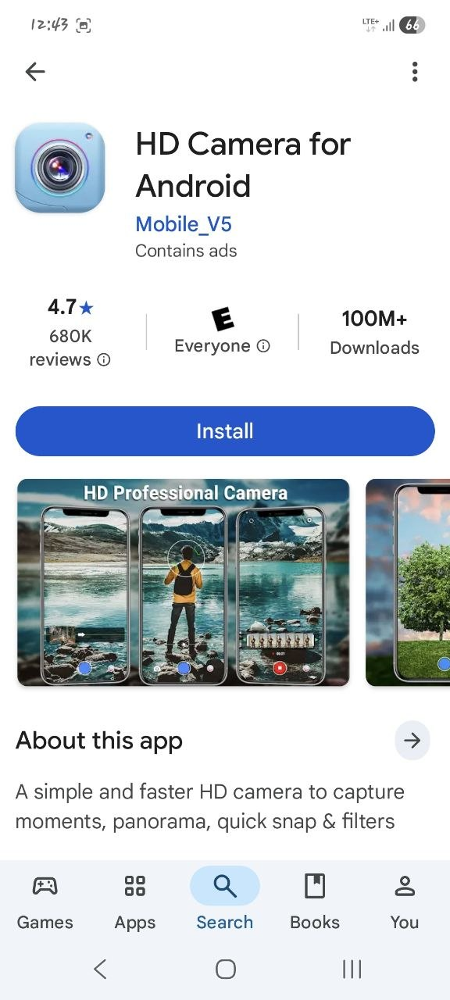
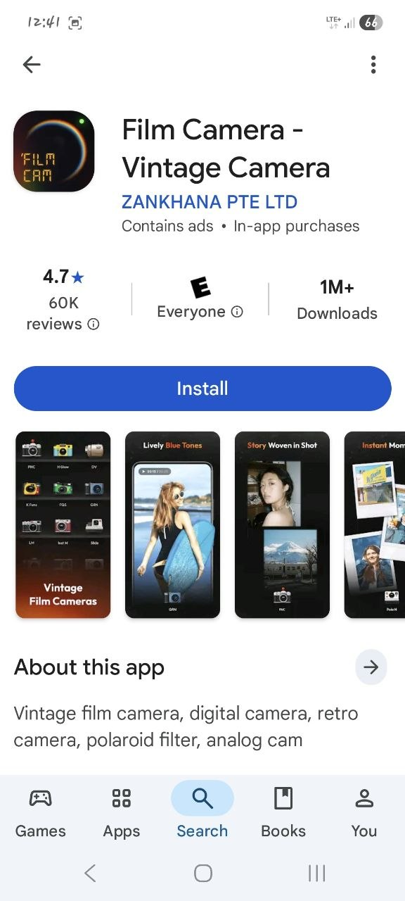
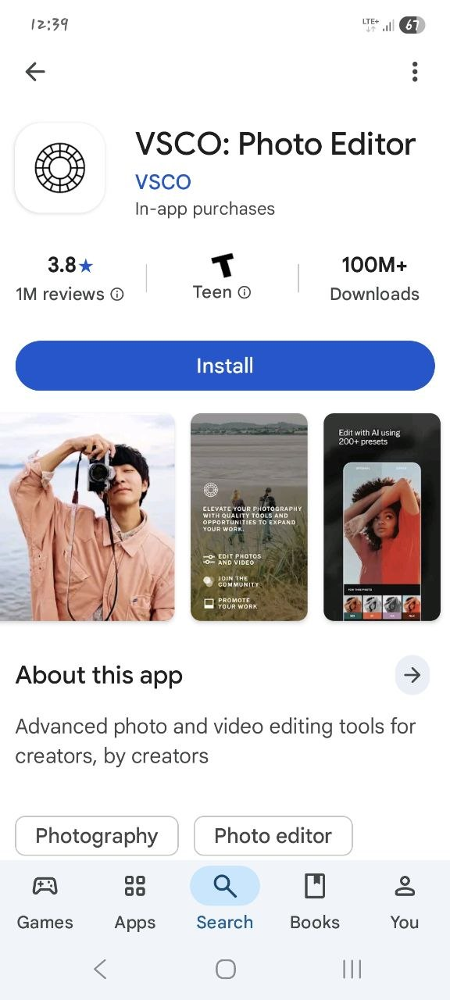
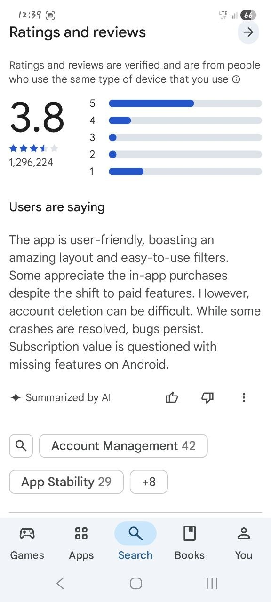
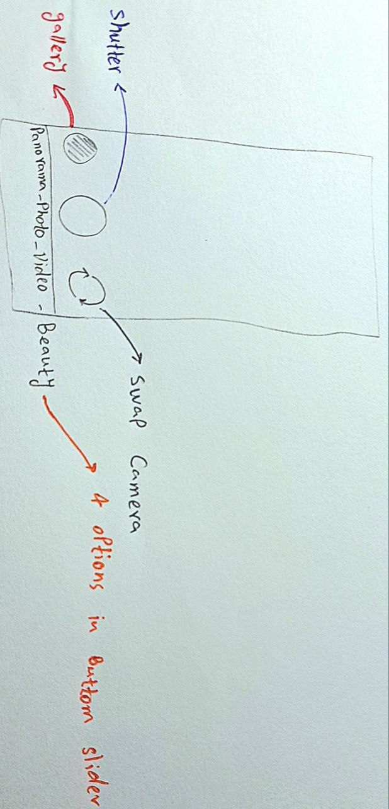

In this stage fo development, I am trying to come up with a definitive idea that will be the cornerstone of the app for the initial stages of its development.

I am mostly looking to follow and copy what these 3 camera apps have done:
 
1- **HD Camera for Android**

2- **Film Camera - Vintage Camera**

3- **VSCO**

This is the most famous one among this 3 and users' mentality about it has been summarized by AI to be like this :

So far, I think the current implementation of the app should look like this ;

And about this implementation, these are the important things to keep in mind:

* we have 4 options in the bottom slider :
<ol>
    <li>Panorama</li>
    <li>Photo</li>
    <li>Video</li>
    <li>Beauty</li>
</ol>

* At this time, we don't care about the **timer** and **flashlight** part of the camera.